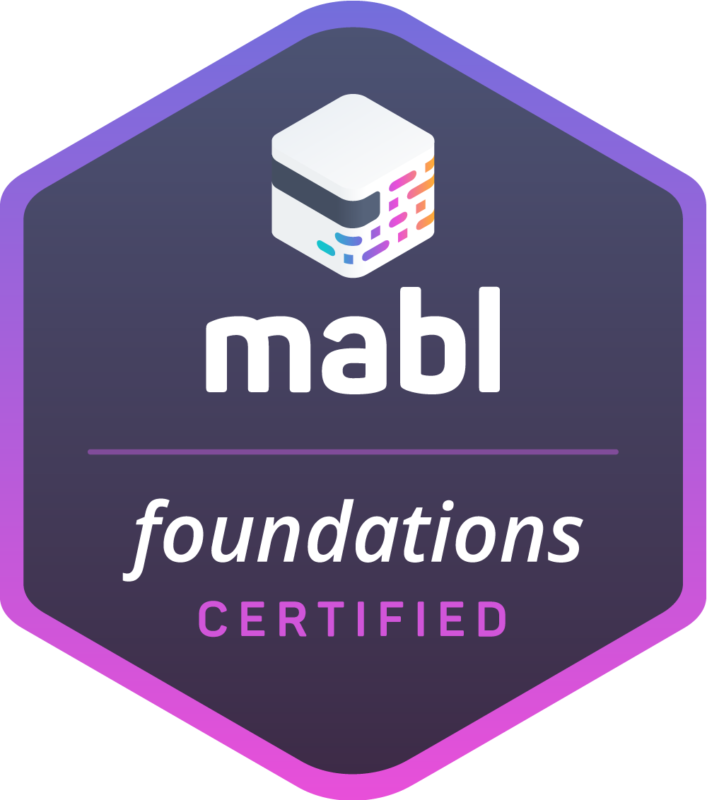
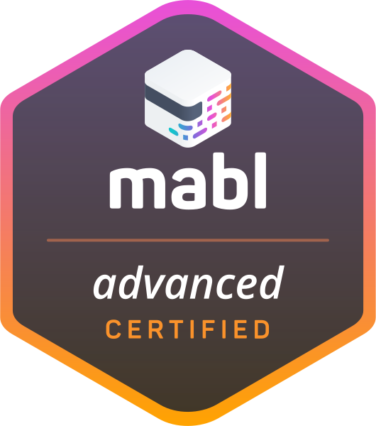
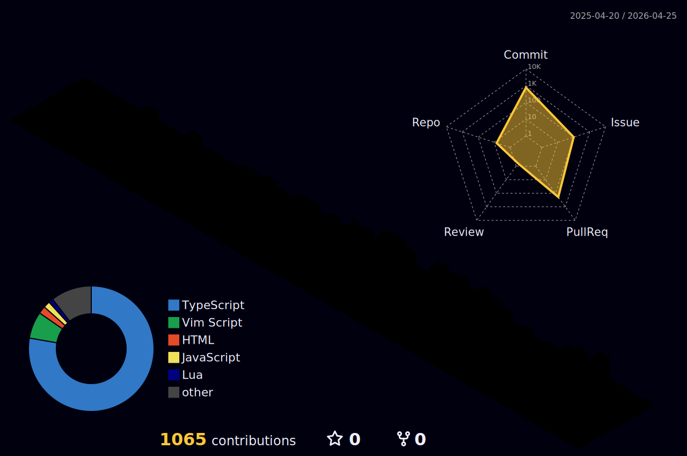

## Blog Posts

- [draw.ioをつかったフレキシブルな設計図作成術](https://kakehashi-dev.hatenablog.com/entry/2024/09/17/110000)
- [Slack次世代プラットフォームで業務効率化に貢献する💪](https://kakehashi-dev.hatenablog.com/entry/2023/12/14/091000)
- [コードフォーマッターをPrettierからdprintにしたら10倍以上速くなった話🚀](https://kakehashi-dev.hatenablog.com/entry/2023/11/27/103000)
- [クロスアカウントアクセスでAppSync Private APIを使う話](https://kakehashi-dev.hatenablog.com/entry/2023/06/21/100000)
- [GitHub Actions上でテストを約3倍早くした話](https://kakehashi-dev.hatenablog.com/entry/2023/03/14/103000)
- [Amplify Studioでチームポータルページを作ってみた](https://kakehashi-dev.hatenablog.com/entry/2022/10/18/100000)
- [AWSの負荷テストソリューションを使ったGraphQLの負荷テスト](https://kakehashi-dev.hatenablog.com/entry/2022/08/31/100000)
- [【開発者でもできる!】OWASP ZAPを利用したGraphQLアプリケーションへの脆弱性診断](https://kakehashi-dev.hatenablog.com/entry/2022/08/17/100000)
- [Presigned URLを利用したS3へのファイルアップロード](https://kakehashi-dev.hatenablog.com/entry/2022/03/15/101500)
- [まったく新しい開発体験をもたらすServerless Stackとは何か](https://kakehashi-dev.hatenablog.com/entry/2022/01/13/080000)
- [チームで技術的負債とどう向き合って来たか](https://kakehashi-dev.hatenablog.com/entry/2021/08/31/080000)
- [Kakehashi Looks to Modernize Pharmacies with AWS and Amplify](https://aws.amazon.com/jp/blogs/startups/kakehashi-looks-to-modernize-pharmacies-with-aws-and-amplify/)

## Events & Interview

- [高速な仮説検証ループで届けた新規プロダクトの成果を既存プロダクトにも反映するドリームチームの開発手法 ─ カケハシyabusameインタビュー](https://agilejourney.uzabase.com/entry/2024/09/30/103000)
- [RSGT 2024 他者と働き、チームで成果を出す方法 ~ 人との関係からみるカケハシ ~](https://confengine.com/conferences/regional-scrum-gathering-tokyo-2024/schedule/rich#session-31548-info)
    - [登壇資料](https://speakerdeck.com/kakehashi/kakehashi-of-the-relationship-between-members)
- [キャリア座談会～ヘルスケアスタートアップの現役エンジニアとEMに聞く、キャリアと組織について～](https://kakehashi.connpass.com/event/297921/)
- [tsukiji.graphql #1 @オンライン](https://tsukiji-graphql.connpass.com/event/281413/)
  - [登壇資料](https://speakerdeck.com/kakehashi/tsukiji-dot-graphql-number-1-pocket-musubidenoappsyncnoshi-isuo)
- [【カケハシ/リクルート/LayerX】～テックリードが振り返るアンチパターン～ 新規サービス開発時に「スピード開発×安定運用」を実現するには？](https://techplay.jp/event/888763)
  - [登壇資料](https://speakerdeck.com/kakehashi/deng-tan-oyao-shou-zhang-apurikai-fa-niokeru-supidokai-fa-x-an-ding-yun-yong-noqu-rizu-mi)
- [カケハシエンジニアLT会＠オンライン](https://kakehashi.connpass.com/event/243681/)
- [DX Tech Talk #7 ソフトウェアの活用により対象ドメインの業務フローをどう変えているのか](https://layerx.connpass.com/event/213809/)
- [医療DXスタートアップCTOが描く「医療とエンジニアリングの未来」](https://yojo.connpass.com/event/218693/)


## Languages and Tools

<p align="left">
  <a href="https://aws.amazon.com/amplify/" target="_blank" rel="noreferrer">  </a> <a href="https://angular.io" target="_blank" rel="noreferrer">  </a> <a href="https://aws.amazon.com" target="_blank" rel="noreferrer">  </a> <a href="https://circleci.com" target="_blank" rel="noreferrer">  </a> <a href="https://offeescript.org" target="_blank" rel="noreferrer">  </a> <a href="https://dart.dev" target="_blank" rel="noreferrer">  </a> <a href="https://www.djangoproject.com/" target="_blank" rel="noreferrer">  </a> <a href="https://www.docker.com/" target="_blank" rel="noreferrer">  </a> <a href="https://www.elastic.co" target="_blank" rel="noreferrer">  </a> <a href="https://firebase.google.com/" target="_blank" rel="noreferrer">  </a> <a href="https://flask.palletsprojects.com/" target="_blank" rel="noreferrer">  </a> <a href="https://flutter.dev" target="_blank" rel="noreferrer">  </a> <a href="https://git-scm.com/" target="_blank" rel="noreferrer">  </a> <a href="https://graphql.org" target="_blank" rel="noreferrer">  </a> <a href="https://jasmine.github.io/" target="_blank" rel="noreferrer">  </a> <a href="https://jestjs.io" target="_blank" rel="noreferrer">  </a> <a href="https://www.linux.org/" target="_blank" rel="noreferrer">  </a> <a href="https://www.mysql.com/" target="_blank" rel="noreferrer">  </a> <a href="https://www.nginx.com" target="_blank" rel="noreferrer">  </a> <a href="https://nodejs.org" target="_blank" rel="noreferrer">  </a> <a href="https://www.php.net" target="_blank" rel="noreferrer">  </a> <a href="https://postman.com" target="_blank" rel="noreferrer">  </a> <a href="https://www.python.org" target="_blank" rel="noreferrer">  </a> <a href="https://rubyonrails.org" target="_blank" rel="noreferrer">  </a> <a href="https://redis.io" target="_blank" rel="noreferrer">  </a> <a href="https://www.ruby-lang.org/en/" target="_blank" rel="noreferrer">  </a> <a href="https://lucene.apache.org/solr/" target="_blank" rel="noreferrer">  </a> <a href="https://www.sqlite.org/" target="_blank" rel="noreferrer">  </a> <a href="https://www.typescriptlang.org/" target="_blank" rel="noreferrer">  </a>
</p>


## Certification Badges

<p align="left">
  
  
  
  
  
  
  
</p>


## Summary Activity




<p align="left">
  
  
</p>

[](https://github.com/ryo-ma/github-profile-trophy)
[](https://github.com/vn7n24fzkq/github-profile-summary-cards)
[](https://github.com/vn7n24fzkq/github-profile-summary-cards) [](https://github.com/vn7n24fzkq/github-profile-summary-cards)
[](https://github.com/vn7n24fzkq/github-profile-summary-cards) [](https://github.com/vn7n24fzkq/github-profile-summary-cards)

[](https://git.io/streak-stats)


<!--START_SECTION:waka-->
**I'm an Early 🐤** 

```text
🌞 Morning                34895 commits       ████████████████████████░   95.45 % 
🌆 Daytime                711 commits         ░░░░░░░░░░░░░░░░░░░░░░░░░   01.94 % 
🌃 Evening                943 commits         █░░░░░░░░░░░░░░░░░░░░░░░░   02.58 % 
🌙 Night                  8 commits           ░░░░░░░░░░░░░░░░░░░░░░░░░   00.02 % 
```
📅 **I'm Most Productive on Saturday** 

```text
Monday                   4920 commits        ███░░░░░░░░░░░░░░░░░░░░░░   13.46 % 
Tuesday                  5020 commits        ███░░░░░░░░░░░░░░░░░░░░░░   13.73 % 
Wednesday                4832 commits        ███░░░░░░░░░░░░░░░░░░░░░░   13.22 % 
Thursday                 5056 commits        ███░░░░░░░░░░░░░░░░░░░░░░   13.83 % 
Friday                   4171 commits        ███░░░░░░░░░░░░░░░░░░░░░░   11.41 % 
Saturday                 7264 commits        █████░░░░░░░░░░░░░░░░░░░░   19.87 % 
Sunday                   5294 commits        ████░░░░░░░░░░░░░░░░░░░░░   14.48 % 
```


📊 **This Week I Spent My Time On** 

```text
🕑︎ Time Zone: Asia/Tokyo

💬 Programming Languages: 
Python                   1 hr 10 mins        ██████████░░░░░░░░░░░░░░░   41.88 % 
Markdown                 31 mins             █████░░░░░░░░░░░░░░░░░░░░   18.74 % 
Text                     28 mins             ████░░░░░░░░░░░░░░░░░░░░░   17.00 % 
TypeScript               18 mins             ███░░░░░░░░░░░░░░░░░░░░░░   10.97 % 
JSON                     11 mins             ██░░░░░░░░░░░░░░░░░░░░░░░   06.62 % 

🔥 Editors: 
Cursor                   2 hrs 13 mins       ████████████████████░░░░░   78.91 % 
VS Code                  35 mins             █████░░░░░░░░░░░░░░░░░░░░   21.09 % 

💻 Operating System: 
Mac                      2 hrs 48 mins       █████████████████████████   100.00 % 
```

**Timeline**


 Last Updated on 02/05/2025 18:51:51 UTC
<!--END_SECTION:waka-->

