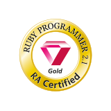
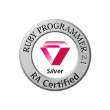

## Blog Posts

### [KAKEHASHI Tech Blog](https://kakehashi-dev.hatenablog.com/)

- [【開発者でもできる!】OWASP ZAPを利用したGraphQLアプリケーションへの脆弱性診断](https://kakehashi-dev.hatenablog.com/entry/2022/08/17/100000)
- [Presigned URLを利用したS3へのファイルアップロード](https://kakehashi-dev.hatenablog.com/entry/2022/03/15/101500)
- [まったく新しい開発体験をもたらすServerless Stackとは何か](https://kakehashi-dev.hatenablog.com/entry/2022/01/13/080000)
- [チームで技術的負債とどう向き合って来たか](https://kakehashi-dev.hatenablog.com/entry/2021/08/31/080000)


## Languages and Tools

<p align="left">
  <a href="https://aws.amazon.com/amplify/" target="_blank" rel="noreferrer">  </a> <a href="https://angular.io" target="_blank" rel="noreferrer">  </a> <a href="https://aws.amazon.com" target="_blank" rel="noreferrer">  </a> <a href="https://circleci.com" target="_blank" rel="noreferrer">  </a> <a href="https://offeescript.org" target="_blank" rel="noreferrer">  </a> <a href="https://dart.dev" target="_blank" rel="noreferrer">  </a> <a href="https://www.djangoproject.com/" target="_blank" rel="noreferrer">  </a> <a href="https://www.docker.com/" target="_blank" rel="noreferrer">  </a> <a href="https://www.elastic.co" target="_blank" rel="noreferrer">  </a> <a href="https://firebase.google.com/" target="_blank" rel="noreferrer">  </a> <a href="https://flask.palletsprojects.com/" target="_blank" rel="noreferrer">  </a> <a href="https://flutter.dev" target="_blank" rel="noreferrer">  </a> <a href="https://git-scm.com/" target="_blank" rel="noreferrer">  </a> <a href="https://graphql.org" target="_blank" rel="noreferrer">  </a> <a href="https://jasmine.github.io/" target="_blank" rel="noreferrer">  </a> <a href="https://jestjs.io" target="_blank" rel="noreferrer">  </a> <a href="https://www.linux.org/" target="_blank" rel="noreferrer">  </a> <a href="https://www.mysql.com/" target="_blank" rel="noreferrer">  </a> <a href="https://www.nginx.com" target="_blank" rel="noreferrer">  </a> <a href="https://nodejs.org" target="_blank" rel="noreferrer">  </a> <a href="https://www.php.net" target="_blank" rel="noreferrer">  </a> <a href="https://postman.com" target="_blank" rel="noreferrer">  </a> <a href="https://www.python.org" target="_blank" rel="noreferrer">  </a> <a href="https://rubyonrails.org" target="_blank" rel="noreferrer">  </a> <a href="https://redis.io" target="_blank" rel="noreferrer">  </a> <a href="https://www.ruby-lang.org/en/" target="_blank" rel="noreferrer">  </a> <a href="https://lucene.apache.org/solr/" target="_blank" rel="noreferrer">  </a> <a href="https://www.sqlite.org/" target="_blank" rel="noreferrer">  </a> <a href="https://www.typescriptlang.org/" target="_blank" rel="noreferrer">  </a>
</p>


## Summary Activity

<p align="left">
  
  
</p>

[](https://github.com/ryo-ma/github-profile-trophy)
[](https://github.com/vn7n24fzkq/github-profile-summary-cards)
[](https://github.com/vn7n24fzkq/github-profile-summary-cards) [](https://github.com/vn7n24fzkq/github-profile-summary-cards)
[](https://github.com/vn7n24fzkq/github-profile-summary-cards) [](https://github.com/vn7n24fzkq/github-profile-summary-cards)

[](https://git.io/streak-stats)


<!--START_SECTION:waka-->


**I'm an Early 🐤**

```text
<<<<<<< HEAD
🌞 Morning    15 commits     ████████████████░░░░░░░░░   65.22%
🌆 Daytime    5 commits      █████░░░░░░░░░░░░░░░░░░░░   21.74%
🌃 Evening    3 commits      ███░░░░░░░░░░░░░░░░░░░░░░   13.04%
=======
🌞 Morning    21 commits     ██████████████████░░░░░░░   72.41% 
🌆 Daytime    5 commits      ████░░░░░░░░░░░░░░░░░░░░░   17.24% 
🌃 Evening    3 commits      ██░░░░░░░░░░░░░░░░░░░░░░░   10.34% 
>>>>>>> 809607d8998307c41d2aaf27c304357561f99524
🌙 Night      0 commits      ░░░░░░░░░░░░░░░░░░░░░░░░░   0.0%

```
📅 **I'm Most Productive on Saturday**

```text
<<<<<<< HEAD
Monday       5 commits      █████░░░░░░░░░░░░░░░░░░░░   21.74%
Tuesday      0 commits      ░░░░░░░░░░░░░░░░░░░░░░░░░   0.0%
Wednesday    0 commits      ░░░░░░░░░░░░░░░░░░░░░░░░░   0.0%
Thursday     1 commits      █░░░░░░░░░░░░░░░░░░░░░░░░   4.35%
Friday       0 commits      ░░░░░░░░░░░░░░░░░░░░░░░░░   0.0%
Saturday     16 commits     █████████████████░░░░░░░░   69.57%
Sunday       1 commits      █░░░░░░░░░░░░░░░░░░░░░░░░   4.35%
=======
Monday       7 commits      ██████░░░░░░░░░░░░░░░░░░░   24.14% 
Tuesday      2 commits      █░░░░░░░░░░░░░░░░░░░░░░░░   6.9% 
Wednesday    0 commits      ░░░░░░░░░░░░░░░░░░░░░░░░░   0.0% 
Thursday     1 commits      ░░░░░░░░░░░░░░░░░░░░░░░░░   3.45% 
Friday       0 commits      ░░░░░░░░░░░░░░░░░░░░░░░░░   0.0% 
Saturday     16 commits     █████████████░░░░░░░░░░░░   55.17% 
Sunday       3 commits      ██░░░░░░░░░░░░░░░░░░░░░░░   10.34%
>>>>>>> 809607d8998307c41d2aaf27c304357561f99524

```


📊 **This Week I Spent My Time On**

```text
⌚︎ Time Zone: Asia/Tokyo

<<<<<<< HEAD
💬 Programming Languages:
No Activity Tracked This Week

🔥 Editors:
No Activity Tracked This Week

💻 Operating System:
No Activity Tracked This Week

```

**I Mostly Code in Ruby**

```text
Ruby                     8 repos             ███████░░░░░░░░░░░░░░░░░░   28.57%
Python                   6 repos             █████░░░░░░░░░░░░░░░░░░░░   21.43%
TypeScript               6 repos             █████░░░░░░░░░░░░░░░░░░░░   21.43%
PHP                      2 repos             █░░░░░░░░░░░░░░░░░░░░░░░░   7.14%
Vim script               2 repos             █░░░░░░░░░░░░░░░░░░░░░░░░   7.14%

```


=======
💬 Programming Languages: 
TypeScript               3 hrs 52 mins       ████████░░░░░░░░░░░░░░░░░   34.59% 
Dart                     3 hrs 1 min         ██████░░░░░░░░░░░░░░░░░░░   26.95% 
Python                   1 hr 7 mins         ██░░░░░░░░░░░░░░░░░░░░░░░   10.02% 
YAML                     45 mins             █░░░░░░░░░░░░░░░░░░░░░░░░   6.82% 
Markdown                 35 mins             █░░░░░░░░░░░░░░░░░░░░░░░░   5.22%

🔥 Editors: 
VS Code                  6 hrs 17 mins       ██████████████░░░░░░░░░░░   56.12% 
Neovim                   4 hrs 54 mins       ███████████░░░░░░░░░░░░░░   43.88%

💻 Operating System: 
Mac                      11 hrs 11 mins      █████████████████████████   100.0%

```

>>>>>>> 809607d8998307c41d2aaf27c304357561f99524
**Timeline**


 Last Updated on 23/08/2022 18:44:52 UTC
<!--END_SECTION:waka-->

## Certification Badges

<p align="left">
  
  
  
  
  
</p>