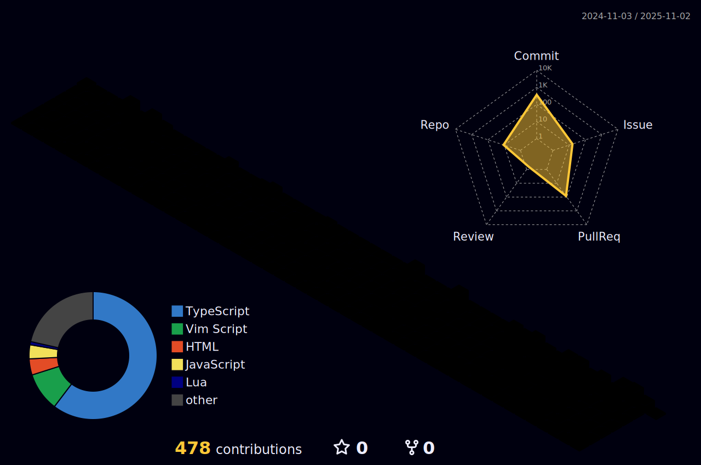

## Blog Posts

- [Amplify Studioでチームポータルページを作ってみた](https://kakehashi-dev.hatenablog.com/entry/2022/10/18/100000)
- [AWSの負荷テストソリューションを使ったGraphQLの負荷テスト](https://kakehashi-dev.hatenablog.com/entry/2022/08/31/100000)
- [【開発者でもできる!】OWASP ZAPを利用したGraphQLアプリケーションへの脆弱性診断](https://kakehashi-dev.hatenablog.com/entry/2022/08/17/100000)
- [Presigned URLを利用したS3へのファイルアップロード](https://kakehashi-dev.hatenablog.com/entry/2022/03/15/101500)
- [まったく新しい開発体験をもたらすServerless Stackとは何か](https://kakehashi-dev.hatenablog.com/entry/2022/01/13/080000)
- [チームで技術的負債とどう向き合って来たか](https://kakehashi-dev.hatenablog.com/entry/2021/08/31/080000)
- [Kakehashi Looks to Modernize Pharmacies with AWS and Amplify](https://aws.amazon.com/jp/blogs/startups/kakehashi-looks-to-modernize-pharmacies-with-aws-and-amplify/)

## Events

- [【カケハシ/リクルート/LayerX】～テックリードが振り返るアンチパターン～ 新規サービス開発時に「スピード開発×安定運用」を実現するには？](https://techplay.jp/event/888763)
  - [登壇資料](https://speakerdeck.com/kakehashi/deng-tan-oyao-shou-zhang-apurikai-fa-niokeru-supidokai-fa-x-an-ding-yun-yong-noqu-rizu-mi)
- [カケハシエンジニアLT会＠オンライン](https://kakehashi.connpass.com/event/243681/)
- [DX Tech Talk #7 ソフトウェアの活用により対象ドメインの業務フローをどう変えているのか](https://layerx.connpass.com/event/213809/)
- [医療DXスタートアップCTOが描く「医療とエンジニアリングの未来」](https://yojo.connpass.com/event/218693/)


## Languages and Tools

<p align="left">
  <a href="https://aws.amazon.com/amplify/" target="_blank" rel="noreferrer">  </a> <a href="https://angular.io" target="_blank" rel="noreferrer">  </a> <a href="https://aws.amazon.com" target="_blank" rel="noreferrer">  </a> <a href="https://circleci.com" target="_blank" rel="noreferrer">  </a> <a href="https://offeescript.org" target="_blank" rel="noreferrer">  </a> <a href="https://dart.dev" target="_blank" rel="noreferrer">  </a> <a href="https://www.djangoproject.com/" target="_blank" rel="noreferrer">  </a> <a href="https://www.docker.com/" target="_blank" rel="noreferrer">  </a> <a href="https://www.elastic.co" target="_blank" rel="noreferrer">  </a> <a href="https://firebase.google.com/" target="_blank" rel="noreferrer">  </a> <a href="https://flask.palletsprojects.com/" target="_blank" rel="noreferrer">  </a> <a href="https://flutter.dev" target="_blank" rel="noreferrer">  </a> <a href="https://git-scm.com/" target="_blank" rel="noreferrer">  </a> <a href="https://graphql.org" target="_blank" rel="noreferrer">  </a> <a href="https://jasmine.github.io/" target="_blank" rel="noreferrer">  </a> <a href="https://jestjs.io" target="_blank" rel="noreferrer">  </a> <a href="https://www.linux.org/" target="_blank" rel="noreferrer">  </a> <a href="https://www.mysql.com/" target="_blank" rel="noreferrer">  </a> <a href="https://www.nginx.com" target="_blank" rel="noreferrer">  </a> <a href="https://nodejs.org" target="_blank" rel="noreferrer">  </a> <a href="https://www.php.net" target="_blank" rel="noreferrer">  </a> <a href="https://postman.com" target="_blank" rel="noreferrer">  </a> <a href="https://www.python.org" target="_blank" rel="noreferrer">  </a> <a href="https://rubyonrails.org" target="_blank" rel="noreferrer">  </a> <a href="https://redis.io" target="_blank" rel="noreferrer">  </a> <a href="https://www.ruby-lang.org/en/" target="_blank" rel="noreferrer">  </a> <a href="https://lucene.apache.org/solr/" target="_blank" rel="noreferrer">  </a> <a href="https://www.sqlite.org/" target="_blank" rel="noreferrer">  </a> <a href="https://www.typescriptlang.org/" target="_blank" rel="noreferrer">  </a>
</p>


## Certification Badges

<p align="left">
  
  
  
  
  
</p>


## Summary Activity




<p align="left">
  
  
</p>

[](https://github.com/ryo-ma/github-profile-trophy)
[](https://github.com/vn7n24fzkq/github-profile-summary-cards)
[](https://github.com/vn7n24fzkq/github-profile-summary-cards) [](https://github.com/vn7n24fzkq/github-profile-summary-cards)
[](https://github.com/vn7n24fzkq/github-profile-summary-cards) [](https://github.com/vn7n24fzkq/github-profile-summary-cards)

[](https://git.io/streak-stats)


<!--START_SECTION:waka-->


**I'm an Early 🐤** 

```text
🌞 Morning                320 commits         ████████████████████░░░░░   80.40 % 
🌆 Daytime                29 commits          ██░░░░░░░░░░░░░░░░░░░░░░░   07.29 % 
🌃 Evening                46 commits          ███░░░░░░░░░░░░░░░░░░░░░░   11.56 % 
🌙 Night                  3 commits           ░░░░░░░░░░░░░░░░░░░░░░░░░   00.75 % 
```
📅 **I'm Most Productive on Saturday** 

```text
Monday                   60 commits          ████░░░░░░░░░░░░░░░░░░░░░   15.08 % 
Tuesday                  47 commits          ███░░░░░░░░░░░░░░░░░░░░░░   11.81 % 
Wednesday                54 commits          ███░░░░░░░░░░░░░░░░░░░░░░   13.57 % 
Thursday                 59 commits          ████░░░░░░░░░░░░░░░░░░░░░   14.82 % 
Friday                   39 commits          ██░░░░░░░░░░░░░░░░░░░░░░░   09.80 % 
Saturday                 70 commits          ████░░░░░░░░░░░░░░░░░░░░░   17.59 % 
Sunday                   69 commits          ████░░░░░░░░░░░░░░░░░░░░░   17.34 % 
```


📊 **This Week I Spent My Time On** 

```text
🕑︎ Time Zone: Asia/Tokyo

💬 Programming Languages: 
Python                   1 hr 24 mins        ███████████░░░░░░░░░░░░░░   42.65 % 
TypeScript               52 mins             ███████░░░░░░░░░░░░░░░░░░   26.73 % 
Markdown                 48 mins             ██████░░░░░░░░░░░░░░░░░░░   24.47 % 
Other                    7 mins              █░░░░░░░░░░░░░░░░░░░░░░░░   03.98 % 
Git                      1 min               ░░░░░░░░░░░░░░░░░░░░░░░░░   00.75 % 

🔥 Editors: 
Neovim                   3 hrs 16 mins       █████████████████████████   99.48 % 
VS Code                  1 min               ░░░░░░░░░░░░░░░░░░░░░░░░░   00.52 % 

💻 Operating System: 
Mac                      3 hrs 17 mins       █████████████████████████   100.00 % 
```

**Timeline**


 Last Updated on 06/03/2023 18:37:23 UTC
<!--END_SECTION:waka-->

